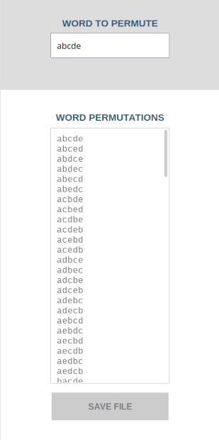
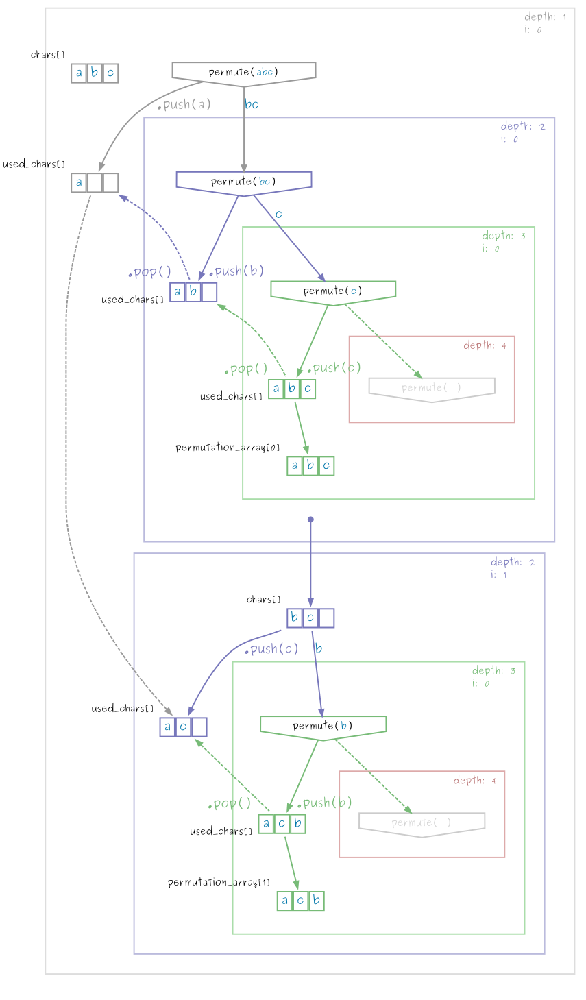
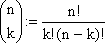

<h1>String Permuter</h1>


This is a string permutation generator application written in *HTML* and *JavaScript*.
You can type in a word with a maximum length of 10 characters into the input field. 
<br>
The application generates all character combinations of the input string value in a list field.

<br>

Online-Version: <https://nowca.github.io/string-permuter/string-permuter.html>

<br>



<br>

<h2>Using the HTML5 Web Worker API</h2>


The Application uses the [Web Worker API](https://www.w3schools.com/html/html5_webworkers.asp) to run the algorithm code asynchronous in the background of the *HTML/JavaScript* application.
<br>

<h3>Algorithm code script</h3>

The *Web Worker function with the permutation algorithm* is called by the event handler function `self.onmessage`
```javascript 
169 | <script id="webworker-script" type="javascript/worker">
170 |     self.onmessage = function(event) {
... |
```
The permutation algorithm code returns the generated list to the program script with `self.postMessage()`
```javascript
203 | self.postMessage(permutation_array.join('\n'));
```

<br>
<h3>Termination of the calculation in the Web Worker thread</h3>

The calculation of the permutation can be canceled by terminating the Web Worker Process with the *Cancel Button* which calls the `webWorkerInstance.terminate()` 

*There is a known Bug in Firefox and Chromium which keeps the Web Worker function broken after terminating the thread.*
<br>

As a workaround the *Web Worker Object is instantiated new after each termination* with the function call `webWorkerInstance.start()`, which creates a new text-blob-buffer-object of the script-code, reinstantiates its own object-instance and updates all necessary functions.


```javascript
325 | webWorkerInstance.start = (function startNewWebWorker()
326 | {
...
332 |     webWorkerInstance = new Worker(
...
348 |     webWorkerInstance.start = this.start;
349 | })
```

<br>

<h2>The Permutation Calculator Algorithm</h2>

<h3>Implemented Permutation Algorithm</h3>

The HTML/JS Application is using a recursive permutation algorithm by mixing the characters of a string to all possible constallation values.
<br>
*(e.g. abc -> acb, bac, bca, cab, cba)*


```javascript 
function permute(input)
{
    var i, char, chars = input.split("");

    for (i = 0; i < chars.length; i++)
    {
        char = chars.splice(i, 1);
        used_chars.push(char);

        if (chars.length == 0)
        {
            permutation_array[permutation_array.length] = used_chars.join("");
        }

        permute(chars.join(""));
        chars.splice(i, 0, char);
        used_chars.pop();
    }
}
```
The original source code of the Permutation Calculator can be found at:
<https://staff.roguecc.edu/JMiller/JavaScript/permute.js>
<br>


<h3>Explanation of the Algorithm Process:</h3>

The calculation is called by
```javascript
364 |  webWorkerInstance.postMessage(elements.inputField.value);
```

The called Web Worker thread runs the algorithm script with the input word
```javascript
234 |  permute(message.data);
```





The visualisation plot is generated with graphviz dot.
<br>*You can find the .dot-file in the doc folder of the repository.*
<br>

e.g. `permute("abc")` is processed like this:

```javascript
permute("abc")
    > permute("bc")
        > permute("c")
            > permute("")
        > permute("b")
            > permute("")
    > permute("ac")
        > permute("c")
            > permute("")
        > permute("a")
            > permute("")
    > permute("ab")
        > permute("b")
            > permute("")
        > permute("a")
            > permute("")
```

So there are 16 function calls for "abc"

<br>

<h3>Complexity and number of function calls</h3>

The algorithm complexity is factorial O(n!) for combinatorical permutation.

> A string with 10 characters would give out "10! = 1 x 2 x 3 x 4 x 5 x 6 x 7 x 8 x 9 x 10 = 3628800" 
*(more than 3 x 10^6 or 3 million combinations)*

(This means it can take a long while to calulcate all the possible values of the string, if it has too many characters.)

For calculation of function calls you can use the formula *k of n elements* without order and repeat if you need to.





<br>


<h3>Data Export</h3>

It is possible to save the generated permutation data as a generated text file.

<br>
